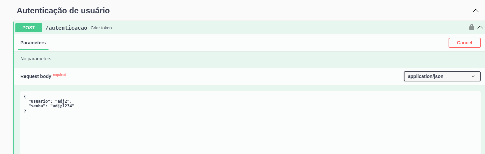
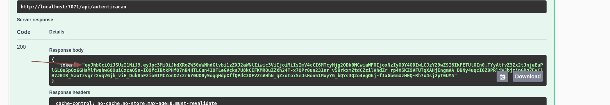
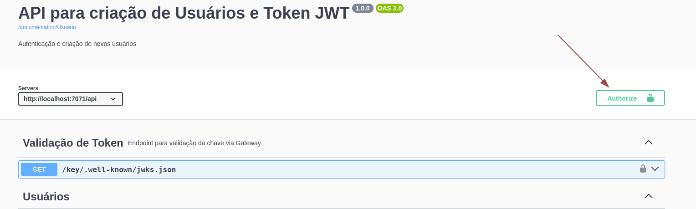

# API para cadastro de usuários e geração de token JWT

## FIAP Hackathon

Este repositório refere-se ao microsserviço de usuários para atender aos requisitos do desafio proposto pela
pós-graduação em arquitetura e desenvolvimento Java.

Este é responsável pela criação de usuaŕios e geração de tokens.

O [Gateway](https://github.com/fysabelah/payment-processing-system/tree/main/gateway-with-authentication) faz uso deste
serviço para autorizar o acesso aos demais.

## Principais recursos deste microserviço

Responsável por cadastrar informações dos usuarios, assim será possível:

* Incluir novos usuários;
* Gerar token para autorização no serviço;
* Consultar usuários do sistema;

## Tecnologias

* Spring Boot para a estrutura do serviço
* Spring Data JPA para manipulação de dados dos clientes
* Spring Security para autorização e autenticação via token JWT
* PostgreSQL para persistência

## Desenvolvedores

- [Aydan Amorim](https://github.com/AydanAmorim)
- [Danilo Faccio](https://github.com/DFaccio)
- [Erick Ribeiro](https://github.com/erickmatheusribeiro)
- [Isabela França](https://github.com/fysabelah)

## Sobre autenticação (opcional)

o método de autenticação utilizado pelo spring security, neste caso, se baseia em ter um par de chaves uma pública e uma
privada, com as duas informações podemos gerar o token de acesso ao serviço.

Você poderá consultar o link a seguir que explica como gerar o par de chaves: https://cryptotools.net/rsagen

este código já dispõe deste par de chaves, são os arquivos "app.pub" e "app.key"

## Informações importantes!

Este serviço foi desenvolvido para ser um material de estudo. Portanto existem vunerabilidades que devem ser tratadas
para um ambiente produtivo.

## Como executar

O projeto possui valores default para variáveis utilizadas, com exceção do _PROFILE_ e _SWAGGER_SERVER_. Logo, caso não
queria alterar
nada, crie o arquivo .env no diretório root com a versão reduzida do arquivo. Do contrário, utilize a versão completa.

    As variáveis podem ser setadas como preferir.

As informações de execução considera que esteja executando apenas este, caso deseje executar todos os serviços, sugiro
verificar o [projeto completo](https://github.com/fysabelah/payment-processing-system).

    Talvez seja interessante clonar o projeto por completo, subir os container e parar o container que deseje executar local.

**Obs.**: Este projeto informará que não foi possível conectar com
a [descoberta de serviços (Eureka Server)](https://github.com/fysabelah/discovery-services/tree/main). Este projeto
também faz conexão com o serviço de cliente, logo, sem o Eureka e serviço de cliente, ele pode não funcionar como o
esperado.

### Versão resumida

```
PROFILE=dev

SWAGGER_SERVER=http://localhost:7072
```

### Versão completa

```
PROFILE=dev

DATABASE_HOST=localhost:5433
DATABASE_USERNAME=root
DATABASE_PASSWORD=root

SWAGGER_SERVER=http://localhost:7072
```

### Primeiros passos

Na raiz do projeto, rodar o comando para subir o container do PostgreeSQL, criar o banco de dados.

```
docker compose up
```

Será criado dois usuários na primeira execução do projeto, ambos possuem perfil administrador. O primeiro refere-se ao
requisitado pela FIAP e o segundo foi por vontade dos desenvolvedores.

```
{
    "usuario": "adj2",
    "senha": "adj@1234"
}
```

```
{
    "usuario": "sudosu",
    "senha": "1amr00t"
}
```

## Acesso a documentação

Por padrão, o tomcat irá subir o serviço na porta 7072, desta maneira você poderá acessar o Swagger (documentação)

```
    http://localhost:7072/doc/user.html
```

Acessando o Swagger, busque pelo endpoint de _Autenticação de usuário_, com exceção deste, todos são bloqueados, logo,
será necessário utilizar um dos usuários previamente cadastrado
para as operações.



Selecione o toke gerado conforme apresentado abaixo.



Adicione o token gerado no _Authorize_ do Swagger, conforme abaixo.



Agora está tudo pronto para testas operações.
